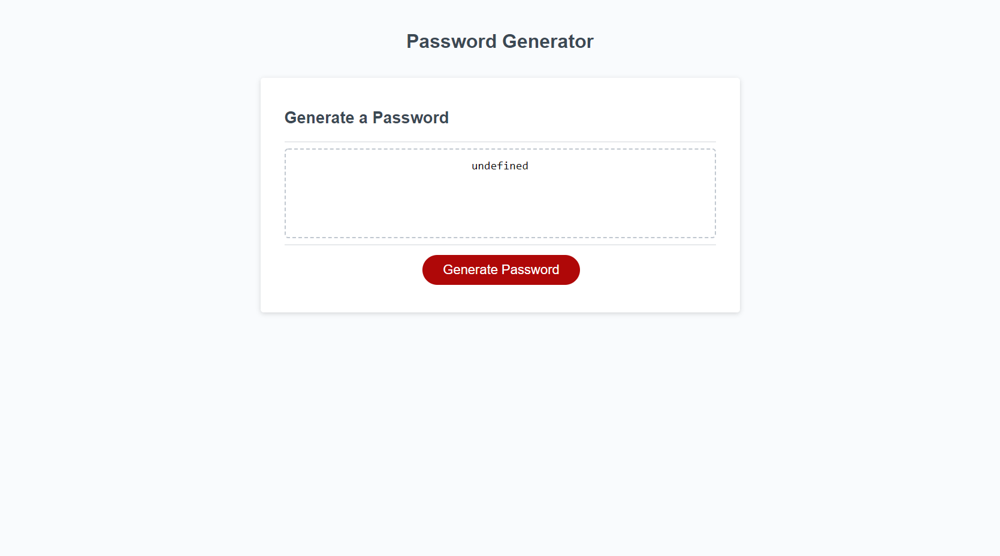
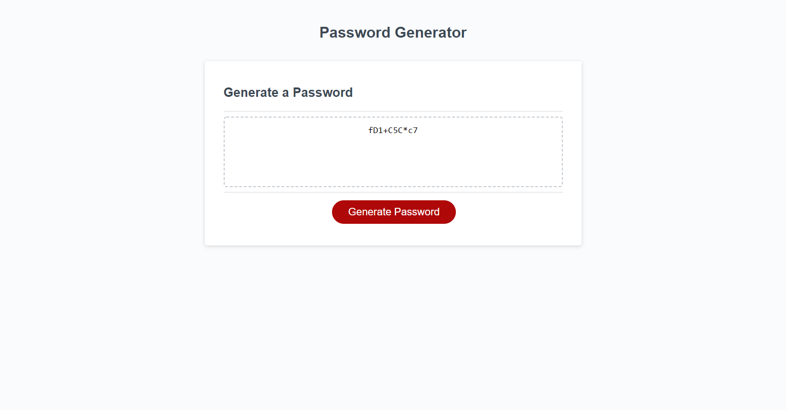

# JavaScript-Inna-s-Callenge-3
My name is Inna Mamedova, I am a student of Birmingham University Coding Bootcamp.
This is my first experience working with JavaScript programming language. This task has been interesting and challenging. I look forward to gaining a deeper understanding of JavaScript.

# Project requirements
Create a random secure password generator application. 
Write a JavaScript code to make the application functional.

# Details
I have created arrays with character types to choose from, and empty arrays to push selected characters to.
I have created a popup boxes to enter or confirm password criteria.
I have used 'concat' and 'push' methods to make sure that at least one character type selected if option confirmed.
I have used 'Math.floor' and 'Math.random' methods to make sure that password characters are generated randomly.
I have created 'for loops' to make sure that all password numbers be randomly generated and, confirmed characters included and password length matches to user choice.
I have returned generated password on the webpage, making sure that comas between characters are removed.
As a result, user can click on a 'Generate Password' button, go through the options and in according box user will see the randomly generated secure password.

# Screenshot

# Link

[Web page](https://inna1201.github.io/JavaScript-Inna-s-Callenge-3/)